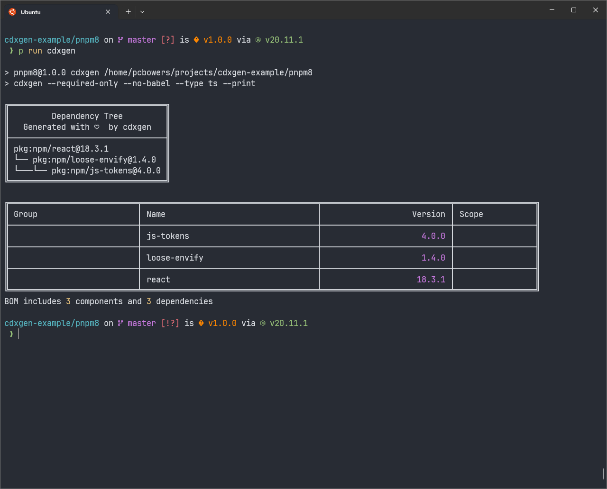
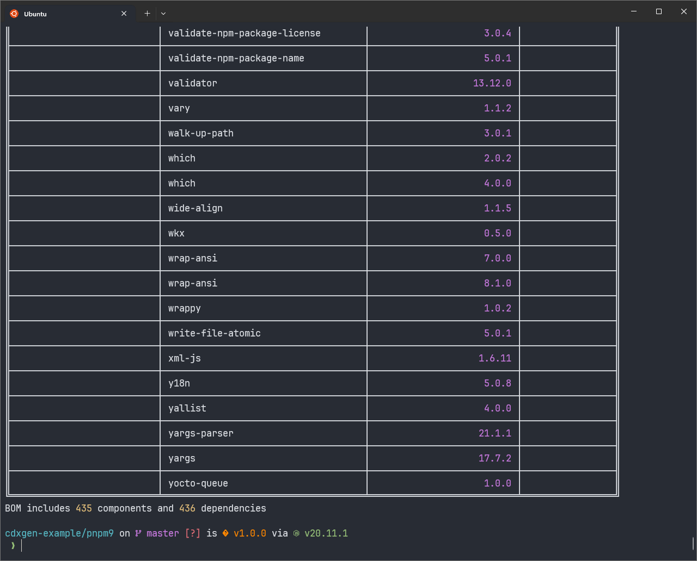

# Example of `--require-only` Option on PNPM 8 and 9

## PNPM v8 (Lockfile v6)

See [bom.json here](pnpm8/bom.json).

BOM includes 3 components and 3 dependencies.

## PNPM v9 (Lockfile v9)

See [bom.json here](pnpm9/bom.json).

BOM includes 435 components and 436 dependencies.

## Running Yourself

1. Clone the repositories
2. Run `pnpm install` in each directory
3. Run `pnpm run cdxgen` in each directory
4. Compare the results
